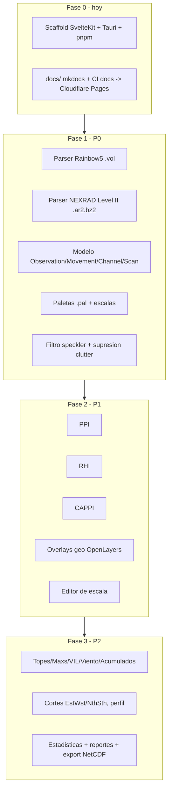

# Plan de implementación

Estado: en discusión — se llena por fases a medida que arrancamos cada una.
Ver [Alcance y prioridades](alcance.md) para el detalle de cada feature.

## Fase 0 — hoy

- [x] Scaffold SvelteKit + Tauri 2 + pnpm (versiones fijadas en [stack.md](stack.md)). Verificado con build/typecheck/lint/test reales, no solo generado.
- [x] `docs/` + `mkdocs.yml` + workflow de CI de docs → Cloudflare Pages.
- [x] `.github/workflows/ci.yml` de la app (ver [ci-cd.md](ci-cd.md)).
- [ ] Setup manual pendiente en Cloudflare (crear los 2 proyectos Pages, secrets del repo) — ver [ci-cd.md](ci-cd.md).
- [ ] Instalar Rust toolchain en un runner/entorno con capacidad de compilar para poder probar `tauri dev`/`cargo build` — no disponible en este sandbox.

## Fase 1 — P0 (fundación)

- [x] Modelo de datos `Observation → Movement (PPI/RHI) → Channel → Scan → Cells`
      (`src/lib/domain/`). Grid de celdas como `Float32Array`/`Uint8Array` paralelos, no objeto
      por celda. Flags normalizados (`ok`/`no-data`/`below-threshold`/`range-folded`) en vez de
      filtrar códigos raw específicos de cada formato al modelo.
- [x] Sistema de parsers plugin (`src/lib/parsers/{types,registry,detect}.ts`): descriptors con
      `canParse()` síncrono barato (extensión + magic bytes) y `load()` por dynamic import
      perezoso. Verificado contra fixtures reales (`<volume` para Rainbow5, gzip magic para
      NEXRAD L2).
- [x] Parser Rainbow5 `.vol` completo (`src/lib/parsers/rainbow5/`): framing de blobs +
      descompresión `qt` (zlib), parser XML mínimo ad-hoc (`src/lib/parsers/xml.ts`, no
      `DOMParser` — funciona igual en Node/browser/Tauri), decode de ángulos por rayo y de datos
      de momento (fórmula `vmin+(raw-1)*scale`). Verificado end-to-end contra los 10 fixtures
      reales de bandaS/bandaX (dBZ/dBuZ/V/W/RhoHV/uPhiDP), valores comparados contra
      `rainbow_probe.py`. Solo volúmenes PPI (`type="vol"`) — RHI sigue sin fixture, lanza error
      explícito si aparece.
- [x] Parser NEXRAD Level II `.ar2`/`.gz` completo (`src/lib/parsers/nexrad-l2/`): gunzip vía
      `DecompressionStream`, framing de mensajes (2432 B fijo salvo tipo 31), Data Header Block +
      moment blocks identificados por su propio tag de 4 bytes (nunca por posición de puntero),
      agrupados por `elevation_number` en Scans por canal/momento (REF/VEL/SW/ZDR/PHI/RHO).
      Verificado end-to-end contra `KMLB20121026_121212_V06.gz` real, valores comparados contra
      `l2_probe_py3.py`. `RadarSite.lat/lon/altM` y `Channel.waveLengthM/beamWidthDeg` quedaron
      opcionales en el modelo: el stream de mensaje-31 no trae esos datos (viven en un bloque de
      constantes de volumen — `RVOL` — que este parser todavía no decodifica, layout no
      verificado).
- [x] Paletas `.pal` + escalas (`src/lib/palette/`): a diferencia de los parsers de formato crudo,
      acá sí sobrevivió el código Delphi original (`legacy/Units/Scale.pas`, `TScale.Load`/
      `GetIndex`/`GetValueColor`) — puerto literal, no reconstrucción por bytes. Lookup es
      _step function_ (umbral más cercano por arriba), no gradiente, aunque el header trae un
      segundo campo ("look") que en el original tampoco se usa para eso. Probado contra los 11
      `.pal` reales de `legacy/Palettes/` (ISO-8859-1, captions multi-palabra tipo "medio alto"
      preservadas).
- [x] Filtro speckler + supresión de clutter vía template (`src/lib/filters/`): puerto literal de
      `TObservation.RemoveRadialSpeckler`/`Sup` en `legacy/Units/Observation.pas`. `lowValue` pasa
      a ser un umbral en unidades físicas (no el TCode crudo original — el modelo nuevo guarda
      valores físicos + flags, no bytes crudos); el caller decide cómo derivarlo del primer stop
      de la paleta si quiere paridad exacta con el original. Preserva un off-by-one real del
      original en `suppressClutter` (`for N:=1 to count-1` nunca toca la última celda del array
      plano). Cargar un `Template<design>.OBS` real ahora sí es posible con el parser `.obs` (ver
      más abajo), pero esta pieza en sí sigue siendo solo el primitivo de enmascarado, probado
      con máscaras sintéticas — falta conectarla a un template real cargado por ese parser.
- [x] Parser `.obs` (Vesta/INSMET) completo (`src/lib/parsers/insmet/`), agregado después del
      cierre inicial de P0 al descubrirse que abrir un `.obs` real fallaba con "No parser recognizes
      file": el formato estaba documentado y verificado (`docs/formatos.md`) pero nunca conectado al
      registry. Agrupa Scans por `(canal físico, momento)` en vez de solo por momento — un mismo
      momento (`dBZ`) puede venir de dos canales físicos distintos con calibración propia en cortes
      batch/split-cut. `Scan.numGates` se deriva de `unpacked_size/sectorCount`, no del
      `number_of_cells` del channel desc (verificado no confiable para el canal de velocidad/ancho
      espectral). Verificado end-to-end contra los 4 fixtures reales de Camagüey.
- [x] Shell app: abrir archivo, config persistente (`src/lib/platform/`, wired into
      `src/routes/+page.svelte`). Web path completo y probado (`happy-dom`): File System Access
      API con fallback a `<input type=file>`, config (`recentFiles`, MRU de 10) en `localStorage`.
      Backend Tauri (`@tauri-apps/plugin-dialog`/`plugin-fs`/`plugin-store`) **no implementado
      todavía** — lanza error explícito ("not implemented yet") en vez de código Rust sin
      compilar/verificar, mismo patrón que el stub inicial de NEXRAD L2: no hay toolchain de Rust
      en este sandbox para verificarlo (ver brecha ya anotada en Fase 0). Build estático
      (`pnpm build` + `vite preview`) verificado, SSR renderiza el botón; no se probó clic real en
      navegador (sin herramienta de browser interactivo en este entorno).

## Fase 2 — P1 (visor core)

Código P1 completo (2026-07-25, automode) — 150 tests verdes, typecheck/lint limpios,
`pnpm build` estático OK. **Falta QA visual** (ver más abajo). Solo target **web** (Tauri
diferido, ver memoria `project-web-only-focus`). Decisiones fijadas con el usuario antes de
arrancar:

1. **Arquitectura de render:** raster georreferenciado sobre OpenLayers. El scan polar se
   remuestrea a `ImageData` (en Web Worker) y se coloca como capa de imagen de OL en el
   `extent` derivado de `site lat/lon` + rango. Las capas geo (costas/ríos/fronteras) son
   capas vectoriales nativas de OL encima. (No canvas standalone, no WebGL por ahora.)
   Nota: NEXRAD L2 no trae `site lat/lon` hasta decodificar `RVOL` — Rainbow5/`.obs` sí.
2. **RHI:** sin fixture real (los 3 parsers solo traen volumen PPI; Rainbow5 RHI lanza
   error). Se construye geometría + visor contra un scan **sintético** hecho a mano;
   cableado a datos reales cuando aparezca un fixture o llegue el corte reconstruido de P2.
3. **Editor de escala:** completo — CRUD de stops + color pickers, re-render en vivo,
   export a `.pal` (ISO-8859-1 / CRLF).
4. **Estrategia automode:** ir en ancho. Toda la matemática (geometría/remuestreo/
   interpolación/altura de haz) con tests unitarios + build estático verde; la QA visual
   (píxeles) queda para revisión manual del usuario — este sandbox no tiene navegador
   interactivo.

**Oráculos de geometría legacy** (ya leídos, portar 1:1):

- Altura de haz: modelo tierra 4/3 (ley de cosenos) en `legacy/Units/HeightTable.pas`
  (`Re=6378.160`, `RefIndex=4/3`, `Rref=RefIndex*Re`, `Ralt=Rref+alt`,
  `height = sqrt(Ralt² + Rpln² − 2·Ralt·Rpln·cos(π/2+elev)) − Rref`; min/max con ±haz/2).
- Rango en tierra = rango oblicuo · cos(elevación).
- CAPPI: promedio de losa a altura constante entre elevaciones
  (`legacy/Units/CAPPIScan.pas` — acumular celdas cuya altura de haz ∈ [bottom,top] en una
  matriz cartesiana de rango-en-tierra, luego promediar por conteo).
- PPI/remuestreo polar→cartesiano: `legacy/Units/Grid.pas` (`TScanGrid.RenderScan`), leer al
  implementar.

**Orden de construcción** (tasks P1.0–P1.8) — todo hecho:

- [x] **P1.0** Instalado `ol@10.9.0`, `xstate@5.32.5` + `@xstate/svelte@5`. **shadcn-svelte
      NO instalado**: su init es interactivo/con red; la UI P1 usa Tailwind plano. El pin en
      `stack.md` sigue válido para retomar shadcn después.
- [x] **P1.1** `src/lib/geo/`: `height.ts` (altura de haz 4/3), `groundRange.ts`, `extent.ts`
      (`site lat/lon`+rango → extent EPSG:3857 con corrección `1/cos(lat)`). Oráculo numérico
      independiente en los tests.
- [x] **P1.2** `src/lib/render/`: `scanSample.ts` (muestreo **inverso** pantalla→polar,
      no el scatter-average del legacy — documentado), `rasterizePPI.ts`, worker
      (`ppi.worker.ts` + `renderClient.ts` con fallback síncrono).
- [x] **P1.3** `src/lib/viewer/PpiMap.svelte`: capa `ImageStatic` georreferenciada, anillos
      (`rings.ts`), lectura azimut/rango/valor (`readout.ts`, puro y testeado).
- [x] **P1.4** `src/lib/overlays/geoLayer.ts` + datos **vendorizados** en `static/geo/`
      (Natural Earth 1:50m recortado a Cuba+Centroamérica, 209 KB; ver
      `scratchpad/fetch-geo.mjs`). Brecha de datos resuelta.
- [x] **P1.5** `src/lib/products/cappi.ts` (+ `measure.ts` para promedio en Z lineal).
      Selector base/tope km en la UI.
- [x] **P1.6** `src/lib/render/rasterizeRHI.ts` + `rhiFixtures.ts`, panel
      `src/lib/viewer/RhiPanel.svelte` (canvas standalone, ejes). Solo datos sintéticos.
- [x] **P1.7** `src/lib/palette/{edit,serialize,default}.ts` + `viewer/ScaleEditor.svelte`.
      Export `.pal` round-trip verificado contra `parsePalette`.
- [x] **P1.8** `src/lib/pipeline/{observationMachine,select}.ts` (XState) cableado en
      `src/routes/+page.svelte` con selectores producto/canal/elevación/altitud.

**Brechas/riesgos a revisar (revisión de mañana):**

- **QA visual pendiente** — lo más importante. Render de PPI/CAPPI/RHI probado solo por
  matemática unitaria + build; nadie vio píxeles. Abrir un `.obs`/`.vol` real en el navegador
  (`pnpm dev`) y confirmar: orientación (N arriba), escala de rango contra los anillos,
  colores contra la paleta, y el readout del mouse. El worker (`ppi.worker.ts`) no se ejecutó
  headless — verificar que el `new Worker(new URL(...))` resuelve en el build de Vite.
- **shadcn-svelte** sin instalar (ver P1.0) — decisión pragmática, no bloqueante.
- NEXRAD L2 sin `site lat/lon` → su PPI/CAPPI muestra un aviso "no georreferenciable" hasta
  decodificar `RVOL`; Rainbow5/`.obs` funcionan.
- Componentes Svelte+OL sin tests de componente (frágiles headless); se cubrió toda la lógica
  extraíble en módulos puros testeados (`readout`, `scanSample`, `rasterize*`, `cappi`,
  `select`, `serialize/edit`, la máquina XState con actores mock).
- **Sin commits** (regla: solo commitear a pedido). Todo el trabajo está en el working tree.

## Fase 3 — P2 (productos derivados)

Pendiente.
