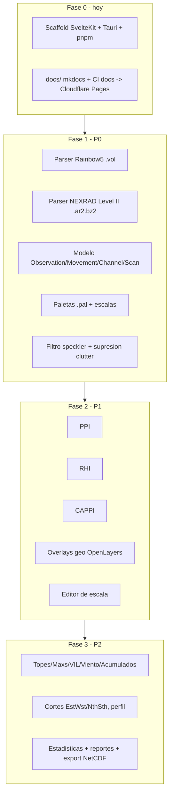

# Plan de implementación

Estado: en discusión — se llena por fases a medida que arrancamos cada una.
Ver [Alcance y prioridades](alcance.md) para el detalle de cada feature.

## Fase 0 — hoy

- [x] Scaffold SvelteKit + Tauri 2 + pnpm (versiones fijadas en [stack.md](stack.md)). Verificado con build/typecheck/lint/test reales, no solo generado.
- [x] `docs/` + `mkdocs.yml` + workflow de CI de docs → Cloudflare Pages.
- [x] `.github/workflows/ci.yml` de la app (ver [ci-cd.md](ci-cd.md)).
- [ ] Setup manual pendiente en Cloudflare (crear los 2 proyectos Pages, secrets del repo) — ver [ci-cd.md](ci-cd.md).
- [ ] Instalar Rust toolchain en un runner/entorno con capacidad de compilar para poder probar `tauri dev`/`cargo build` — no disponible en este sandbox.

## Fase 1 — P0 (fundación)

- [x] Modelo de datos `Observation → Movement (PPI/RHI) → Channel → Scan → Cells`
      (`src/lib/domain/`). Grid de celdas como `Float32Array`/`Uint8Array` paralelos, no objeto
      por celda. Flags normalizados (`ok`/`no-data`/`below-threshold`/`range-folded`) en vez de
      filtrar códigos raw específicos de cada formato al modelo.
- [x] Sistema de parsers plugin (`src/lib/parsers/{types,registry,detect}.ts`): descriptors con
      `canParse()` síncrono barato (extensión + magic bytes) y `load()` por dynamic import
      perezoso. Verificado contra fixtures reales (`<volume` para Rainbow5, gzip magic para
      NEXRAD L2).
- [x] Parser Rainbow5 `.vol` completo (`src/lib/parsers/rainbow5/`): framing de blobs +
      descompresión `qt` (zlib), parser XML mínimo ad-hoc (`src/lib/parsers/xml.ts`, no
      `DOMParser` — funciona igual en Node/browser/Tauri), decode de ángulos por rayo y de datos
      de momento (fórmula `vmin+(raw-1)*scale`). Verificado end-to-end contra los 10 fixtures
      reales de bandaS/bandaX (dBZ/dBuZ/V/W/RhoHV/uPhiDP), valores comparados contra
      `rainbow_probe.py`. Solo volúmenes PPI (`type="vol"`) — RHI sigue sin fixture, lanza error
      explícito si aparece.
- [x] Parser NEXRAD Level II `.ar2`/`.gz` completo (`src/lib/parsers/nexrad-l2/`): gunzip vía
      `DecompressionStream`, framing de mensajes (2432 B fijo salvo tipo 31), Data Header Block +
      moment blocks identificados por su propio tag de 4 bytes (nunca por posición de puntero),
      agrupados por `elevation_number` en Scans por canal/momento (REF/VEL/SW/ZDR/PHI/RHO).
      Verificado end-to-end contra `KMLB20121026_121212_V06.gz` real, valores comparados contra
      `l2_probe_py3.py`. `RadarSite.lat/lon/altM` y `Channel.waveLengthM/beamWidthDeg` quedaron
      opcionales en el modelo: el stream de mensaje-31 no trae esos datos (viven en un bloque de
      constantes de volumen — `RVOL` — que este parser todavía no decodifica, layout no
      verificado).
- [ ] Paletas `.pal` + escalas (import, valor→color).
- [ ] Filtro speckler + supresión de clutter vía template.
- [ ] Shell app: abrir archivo, config persistente.

## Fase 2 — P1 (visor core)

Pendiente.

## Fase 3 — P2 (productos derivados)

Pendiente.
