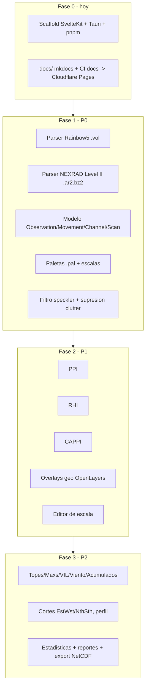

# Plan de implementación

Estado: en discusión — se llena por fases a medida que arrancamos cada una.
Ver [Alcance y prioridades](alcance.md) para el detalle de cada feature.

## Fase 0 — hoy

- [ ] Scaffold SvelteKit + Tauri 2 + pnpm (versiones fijadas en [stack.md](stack.md)).
- [x] `docs/` + `mkdocs.yml` + workflow de CI de docs → Cloudflare Pages.
- [ ] `.github/workflows/ci.yml` de la app — se agrega junto con el scaffold (ver [ci-cd.md](ci-cd.md), referenciar scripts que aún no existen rompería CI en cada push).

## Fase 1 — P0 (fundación)

Pendiente de detallar tareas concretas cuando arranque.

## Fase 2 — P1 (visor core)

Pendiente.

## Fase 3 — P2 (productos derivados)

Pendiente.
